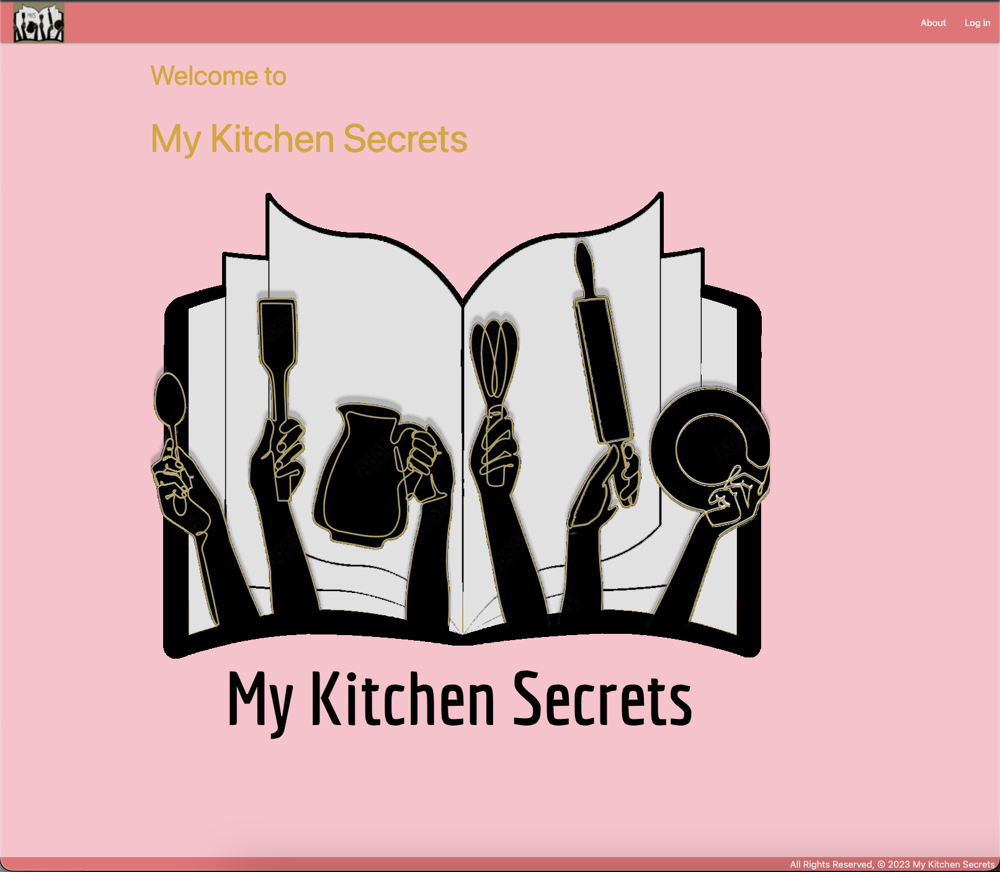
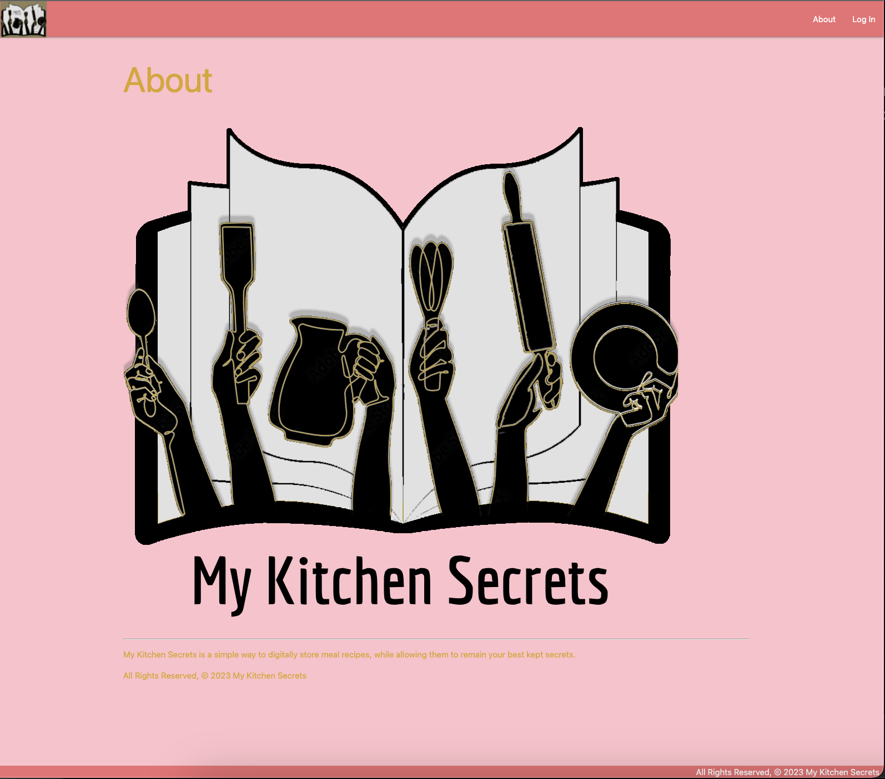
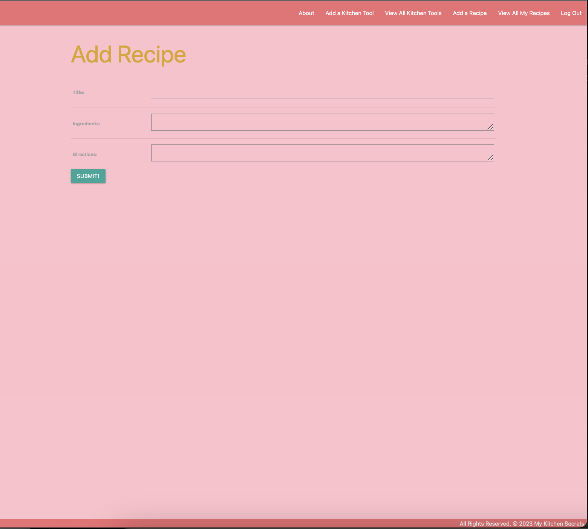
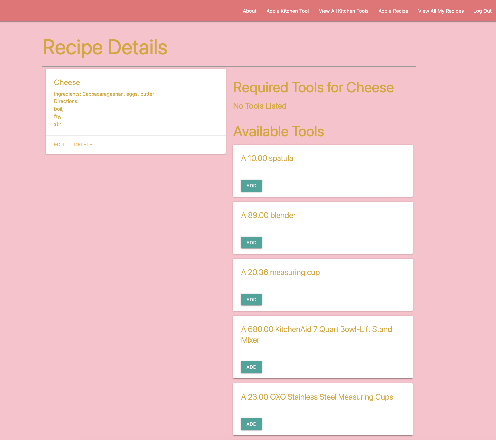
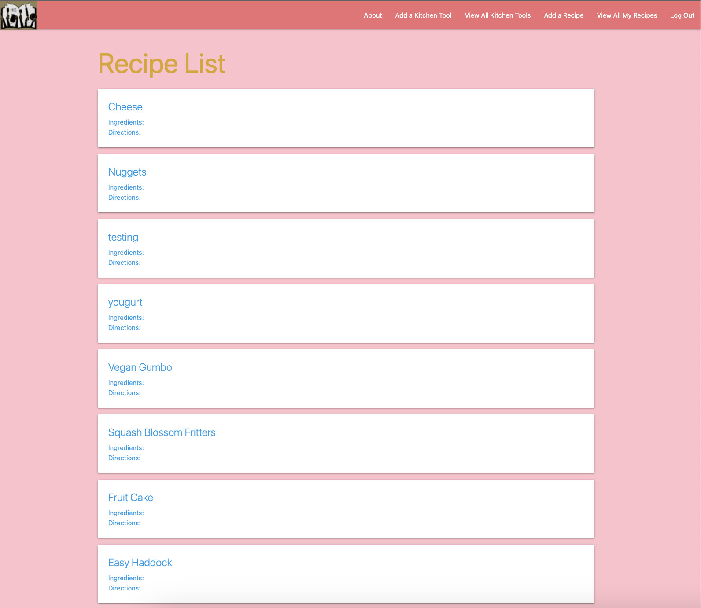
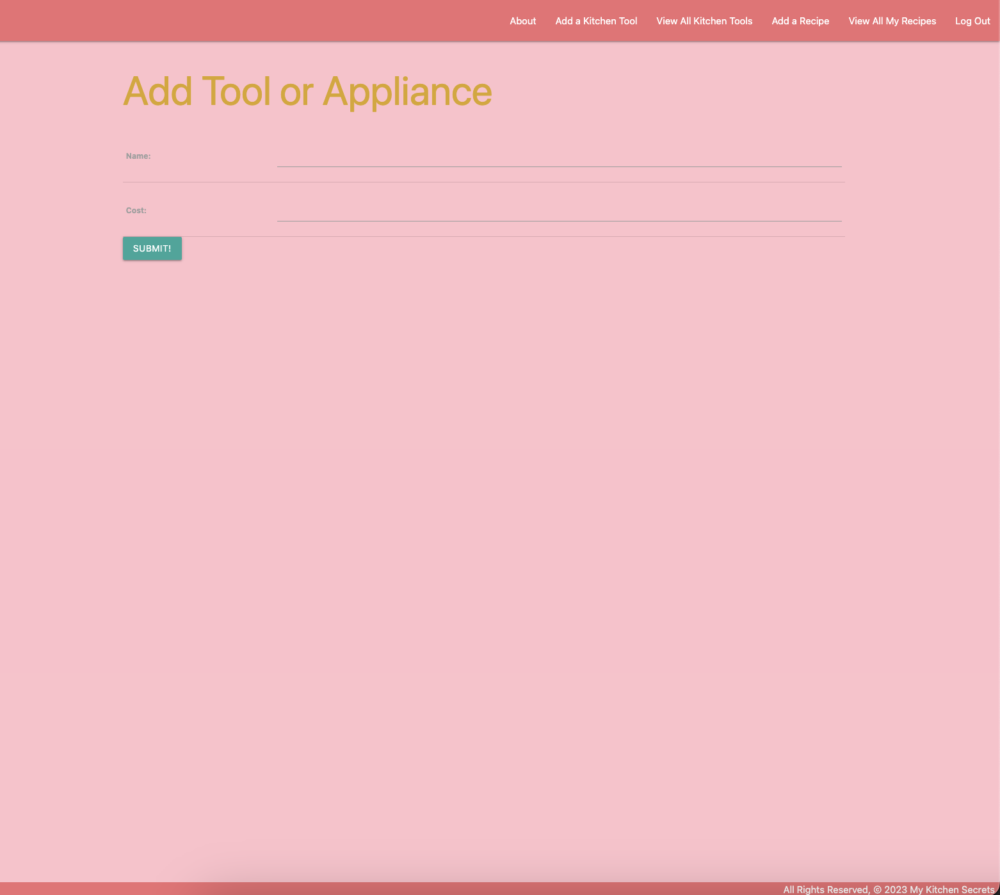
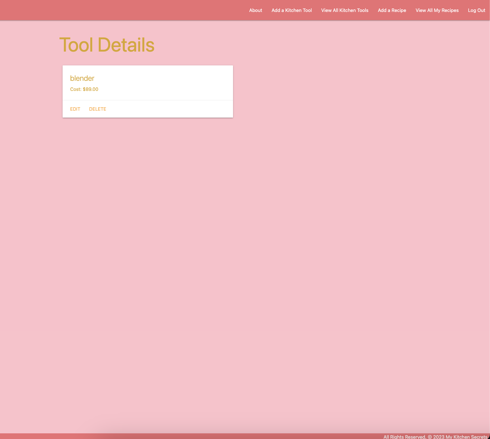
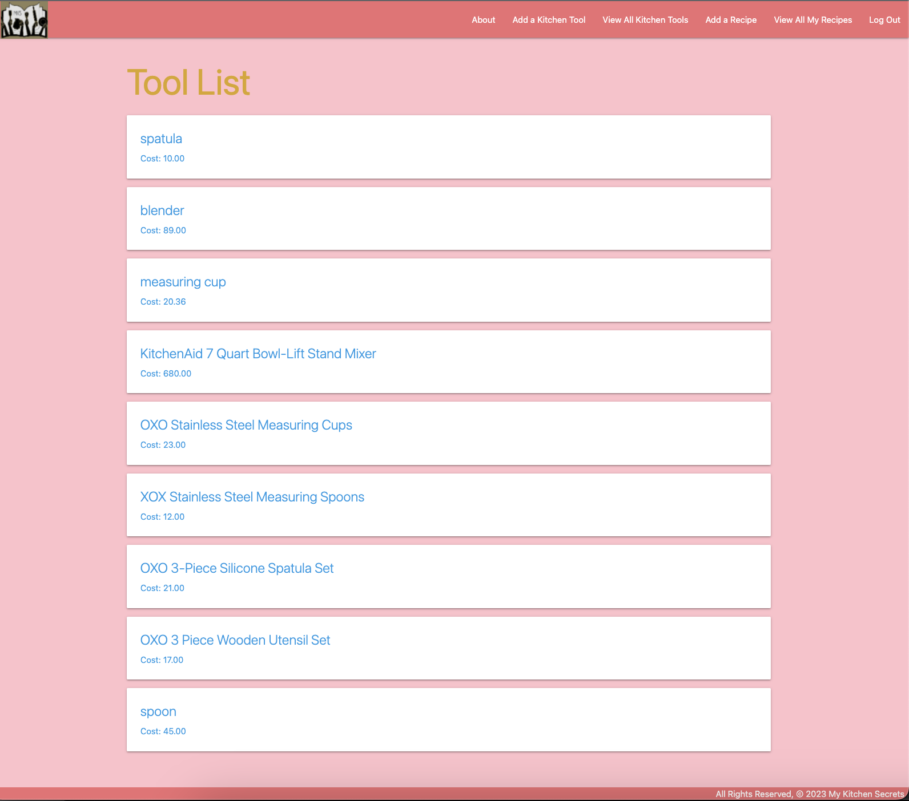

edit css, materialize and add readme.md

# My Kitchen Secrets
My Kitchen Recipes provides a dedicated space to store your favorite recipes and all those kitchen secrets passed down through the generations. My Kitchen Secrets lets users bring their treasured family and secret recipe books into the 21st century, in a digital library made just for that. 

# User Guide
At the homepage, each user is able to view the about and log in page. in order to fully utalize My Kitchen Secrets, a user must login, at which point they are able to use the navigation bar to view their recipes and kitchen tools. The user is able to CRUD kitchen tools and recipes, view all tools and recipes and even add any tool(s) to each recipe to make cooking prep easier.

# Screenshot

Home page

About page

Add Recipe page

Recipe Detail page

All Recipes page

Add Tool page

Tool Details Page

All Tools page

# Technologies Used

- Python
- HTML
- CSS
- CardStarter CSS Library
- Neon
- SQL
- Django
- Bootstrap
- Materialize

# Getting Started

Link to Trello Board: https://trello.com/b/j1FY9Ltm/project-3

Link to Deployed Project: https://mykitchensecrets.onrender.com/

# MVP User Stories
- As a user, I want to log in
- As a user, I want to log out
- As a user, I want my recipes and tools to be accessible my only me
- As a user, I want to CRUD recipes with ingredients and directions
- As a user, I want to view all my recipes
- As a user, I want to CRUD tools with a title and cost
- As a user, I want to view all my tools
- As a user, I want to add tools to any recipes
- As a user, I want to delete tools from any recipes

# Next Steps

Future enhancements
- As a user, I want to add photos to my recipes
- As a user, I want to browse for new recipes via an API
- As a user, I want to add comments and tips to my recipes as I learn
- As a user, I want to add/have a profile photo
- As a user, I want the option to share my recipes to social media apps
- As a user, I want to be able to print a pdf, or other file type, of my recipe(s)
- As a user, I want a cover photo to accompany each recipe on my recipe list, ie. 'View All Recipes'
- As a user, I want to see text as i type it in